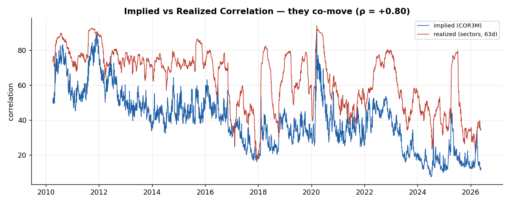
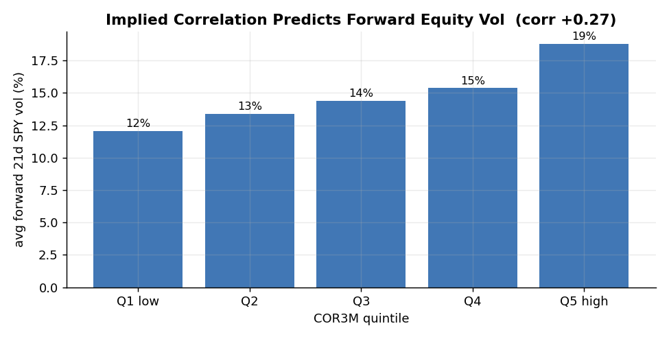
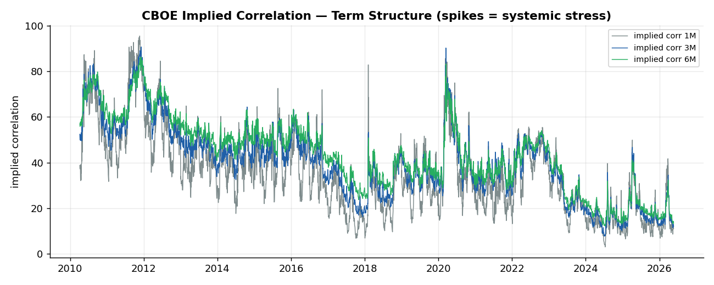
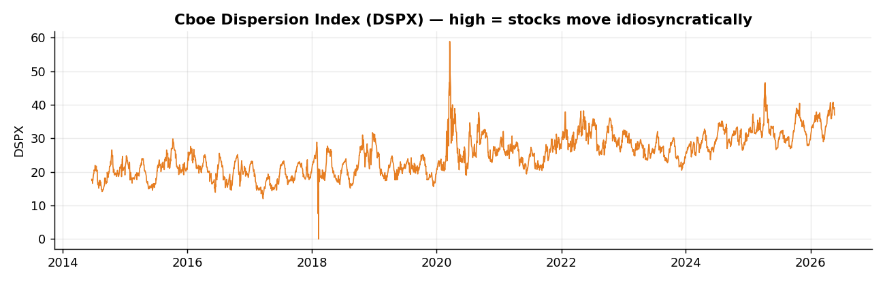
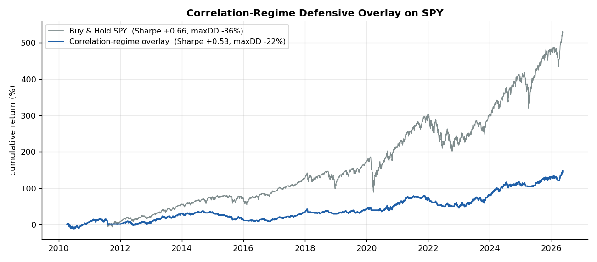
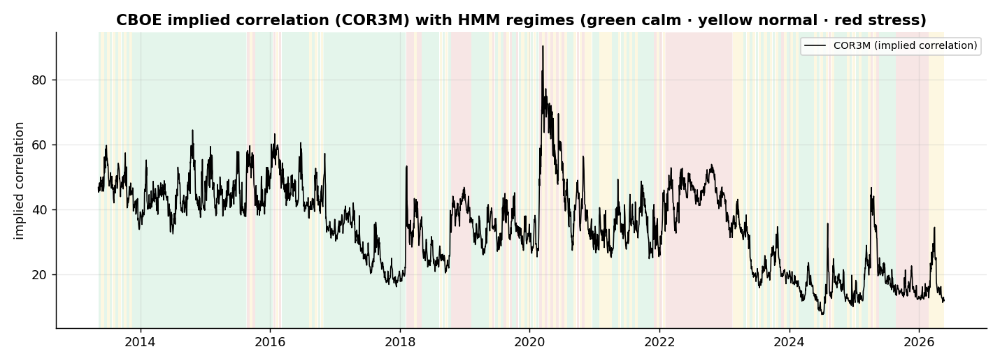
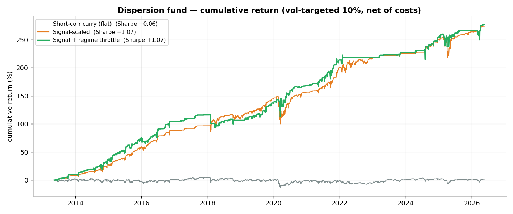
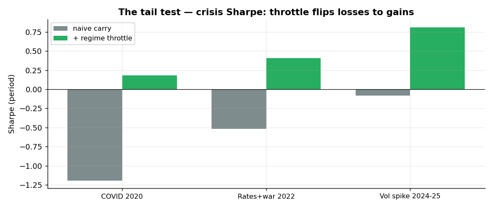

# Implied Correlation & Dispersion Engine

> A monitor and signal engine for **equity correlation risk**, built on CBOE implied-correlation indices (`.COR1M/3M/6M`) and the Cboe Dispersion Index (`.DSPX`). It validates implied correlation against realized sector correlation, shows it **leads equity volatility**, and turns it into a defensive overlay. LSEG data, 2010–2026.



## Why this project matters

Diversification relies on assets *not* moving together — but correlation **spikes exactly in crises** (2008, 2020, 2022), precisely when diversification is needed most. The market prices this through **implied correlation**; this engine monitors it, validates it, and uses it as a systemic-risk signal.

It bridges a master's thesis on equity-correlation regimes (which builds a *realized* Correlation Synchronicity Index) with the market's *implied* counterpart.

## Key results (2010–2026)

**Validation — implied correlation is a genuine risk gauge**
- It **co-moves with realized** sector correlation: **ρ = +0.80** (convergent validity).
- It **predicts forward equity volatility**: corr(COR3M, next-21d SPY vol) = **+0.27**; DSPX = **+0.35**.



**Monitor (current)** — COR3M ≈ 12 (≈ 1st percentile, a record-low / dispersion regime), term structure in contango.




**Defensive overlay** — cut SPY exposure as implied correlation rises:

| Strategy | Sharpe | CAGR | Vol | Max DD | Calmar |
|----------|:------:|:----:|:---:|:------:|:------:|
| Buy & Hold SPY | +0.66 | +10.5% | 17.3% | −36.1% | +0.29 |
| Correlation-regime overlay | +0.53 | +5.2% | 10.5% | **−21.6%** | +0.24 |



> **Honest read:** the overlay is a **risk reducer**, not a return booster — in a long bull market, staying invested wins, so it trades some return for a materially smaller drawdown (−36% → −22%). The headline result is the **validation**: implied correlation tracks realized correlation and leads volatility, confirming it as a systemic-risk indicator.

## Method

- **Implied** correlation: CBOE `.COR3M` (option-derived, forward-looking).
- **Realized** correlation: weighted-average pairwise correlation of 9 GICS sector ETFs, rolling 63d (the thesis-style measure).
- **Signal**: z-score of COR3M (252d). Overlay position = 100% (z<0), 50% (0<z<1), 0% (z>1).
- **No look-ahead**: signals `shift(1)`; forward vol used only for *evaluation*, never as a feature.

## Risk controls & robustness

- Look-ahead-free; subperiod robustness across four regime eras; automated `quant_checks` + `pytest` (6 tests).

## Limitations

- Implied (top-50 single-stock) and realized (9-sector) correlations differ in universe and level — the comparison is on **dynamics**, not absolute level.
- Overlay is daily long-only equity scaling. Research only — **not investment advice**.

## Systematic dispersion fund — trading the correlation risk premium

The monitor above *validates* the signal; this layer *trades* it. A dispersion book is
structurally **short correlation** (short index vol / long the components): it earns a
premium because index options are dear, but it blows up when correlation gaps to 1 in a
crisis. The crown question: **can a regime detector neutralise that crash tail?**



We size a short implied-correlation position by its **richness** (z-score of COR3M — the
thesis signal), and overlay a **walk-forward Gaussian HMM regime throttle** that cuts the
book to zero in confirmed stress. (Because implied and realized correlation sit on
different universes, we trade the implied-correlation index mark-to-market directly, not a
cross-universe spread — see honesty notes.)

### Result (out-of-sample 2013–2026, net of 5 bps/turnover, vol-targeted 10%)

| Book | Sharpe | CAGR | Max DD | Calmar |
|------|:------:|:----:|:------:|:------:|
| Short-corr carry (flat) | +0.06 | +0.1% | −18.2% | +0.01 |
| Signal-scaled (sell when rich) | +1.07 | +10.7% | −19.7% | +0.54 |
| **Signal + regime throttle** | **+1.07** | +10.7% | **−12.4%** | **+0.86** |



**Three findings:**
1. **Naive short correlation is dead money** (Sharpe ≈ 0) — the secular decline in implied
   correlation is paid back in crash losses.
2. **Sizing by implied-correlation richness harvests a real premium** (Sharpe +1.07) — the
   thesis signal, made tradable.
3. **The HMM regime throttle removes the crash tail** — same Sharpe, but max drawdown
   −19.7% → −12.4% and Calmar +0.54 → +0.86. In **every** studied crisis it flips the book
   from losing to flat/positive:



### Honesty notes

- Implied (CBOE top-50 single-stock) and realized (9-sector) correlations differ in
  universe and level — only their **dynamics** co-move (ρ = +0.80). So the trade is the
  **mark-to-market of a short position in the implied-correlation index**, not a
  cross-universe `implied − realized` premium (which would be a meaningless spread).
- A transparent **research proxy** for a correlation/variance-swap dispersion book — full
  single-name option surfaces aren't available daily over 2010–2026.
- Research only, vol-normalised PnL — **not investment advice**.

Run it: `python scripts/run_fund.py`.

## Repository structure

```
implied-correlation-dispersion/
├── README.md · LICENSE · requirements.txt
├── data/raw_prices/   # .COR1M/3M/6M, .DSPX, 9 sector ETFs, SPY (LSEG)
├── src/
│   ├── data.py        # load indices + sectors + SPY
│   ├── engine.py      # realized corr, validation, overlay, quant_checks
│   ├── metrics.py     # performance/risk metrics
│   └── plots.py       # figures
├── scripts/
│   ├── run_analysis.py
│   └── generate_report.py
├── tests/test_engine.py
├── docs/assets/
└── reports/tearsheet.md
```

## How to run

```bash
pip install -r requirements.txt
python scripts/run_analysis.py        # monitor + validation + overlay + checks
python scripts/generate_report.py     # figures + tearsheet
pytest -q
```

*Built with Python (pandas, numpy, matplotlib). Data: LSEG / Refinitiv. Operationalizes a master's thesis on equity-correlation regimes.*
